# Итоговое домашнее задание ETL по 4 модулю

## Описание проекта

В рамках итогового домашнего задания необходимо выполнить следующие задачи:

1. Загрузка данных в YDB и перенос в Object Storage
2. Обработка данных с помощью PySpark и Airflow
3. Потоковая обработка данных через Kafka и Spark Streaming
4. Визуализация данных в DataLens

---

# Структура задания

```text
final_etl_homework/
│
├── task1_ydb_datatransfer/
│   ├── data/
│   ├── screenshots/
│   └── yql/
│   
│
├── task2_airflow_dataproc/
│   ├── dags/
│   ├── scripts/
│   ├── data/
│   └── screenshots/
│   
│
├── task3_kafka_pyspark/
│   ├── scripts/
│   ├── data/
│   └── screenshots/
│   
│
├── task4_datalens/
│   └── screenshots/
│  
│
└── README.md
```

---

# Задание 1. Работа с Yandex DataTransfer

### Описание

В первом задании необходимо было загрузить данные в YDB, а затем перенести их в Object Storage с помощью сервиса Data Transfer

В качестве исходных данных использовался датасет с мировыми ценами на продукты питания

В задании использовались следующие сервисы Yandex Cloud:

- Object Storage
- Managed Service for YDB
- Data Transfer
- Service Account

Для задания был выбран датасет Global Food Prices Database

Ссылка на датасет: https://www.kaggle.com/datasets/abhishekgupta56447/global-food-prices-database-wfp

Данные представлены в формате CSV и содержат информацию о ценах на продукты питания в разных странах.

Поля датасета:

- countryiso3
- date
- admin1
- admin2
- market
- market_id
- latitude
- longitude
- category
- commodity
- commodity_id
- unit
- priceflag
- pricetype
- currency
- price
- usdprice

### Ход выполнения

### 1. Создание бакета Object Storage

Сначала был создан бакет в Object Storage.

Бакет использовался для хранения исходных CSV-файлов и результата переноса данных.

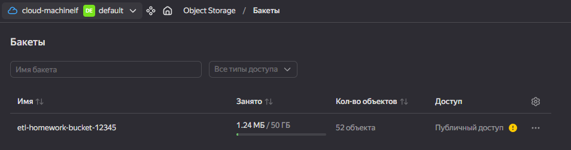


### 2. Создание сервисного аккаунта

Для работы сервисов был создан сервисный аккаунт.

Ему были выданы необходимые права для работы с YDB, Object Storage и Data Transfer

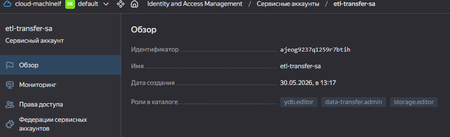


### 3. Создание базы данных YDB

Далее была создана база данных в Managed Service for YDB.

База данных использовалась как источник данных для Data Transfer.

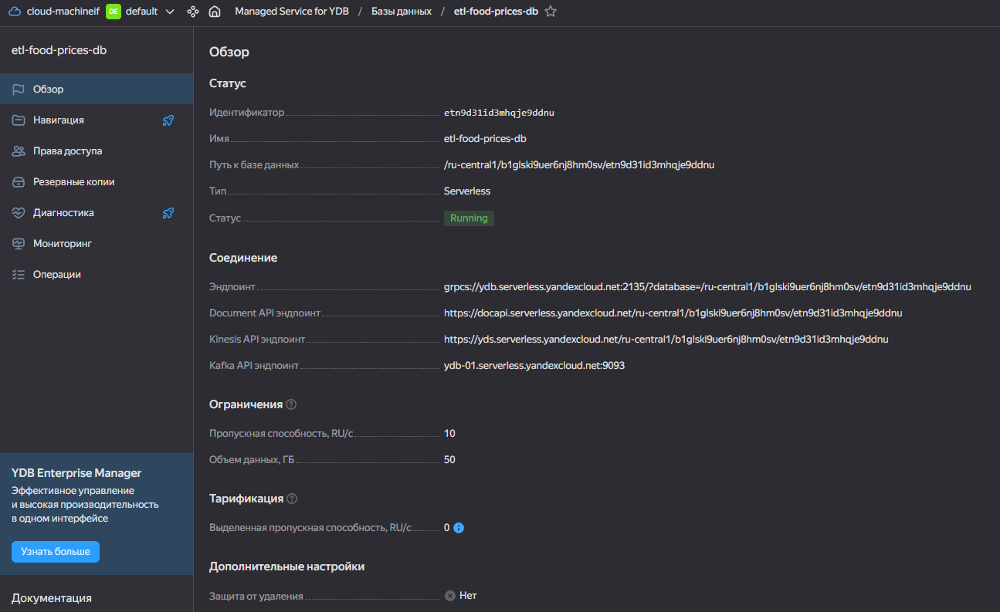

### 4. Создание таблицы в YDB

В YDB была создана таблица food_prices

Для создания таблицы использовался SQL-скрипт create_food_prices.sql

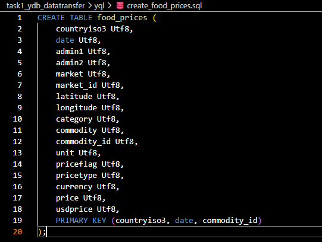

Пример структуры таблицы:

```sql
CREATE TABLE food_prices (
    countryiso3 Utf8,
    date Utf8,
    admin1 Utf8,
    admin2 Utf8,
    market Utf8,
    market_id Utf8,
    latitude Utf8,
    longitude Utf8,
    category Utf8,
    commodity Utf8,
    commodity_id Utf8,
    unit Utf8,
    priceflag Utf8,
    pricetype Utf8,
    currency Utf8,
    price Utf8,
    usdprice Utf8,
    PRIMARY KEY (countryiso3, date, commodity_id)
);
```

### 5. Загрузка данных в таблицу YDB

После создания таблицы данные из CSV-файлов были загружены в YDB с помощью YDB CLI

Для выполнения задания были загружены данные за 2015, 2020 и 2021 годы, общий  размер CSV файлов превышал 30 МБ

Для загрузки использовалась команда:

Для импорта использовалась команда:

```bash
MSYS_NO_PATHCONV=1 ydb -e grpcs://ydb.serverless.yandexcloud.net:2135 \
-d /ru-central1/b1glski9uer6nj8hm0sv/etn9d3i1d3mhqje9ddnu \
--iam-token-file token.txt \
import file csv \
--path food_prices \
--header \
"E:/etl_hse/final_etl_homework/task1_ydb_datatransfer/data/wfp_food_prices_global_2021.csv"
```
Аналогичным образом были импортированы CSV-файлы за другие годы.

В результате данные успешно загрузились в таблицу food_prices

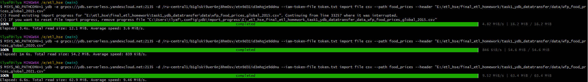

### 6. Создание Data Transfer

После загрузки данных в таблицу food_prices был создан трансфер в сервисе Data Transfer

Трансфер использовался для переноса данных из YDB в Object Storage

Источник трансфера:

```text
YDB
```

Приёмник трансфера:

```text
Object Storage
```

При создании трансфера были настроены:

- endpoint источника YDB;
- endpoint приемника Object Storage;
- сервисный аккаунт;
- путь для сохранения данных в бакете.

После настройки трансфер был успешно запущен.

### 7. Завершение трансфера

После запуска трансфер успешно завершил перенос данных.


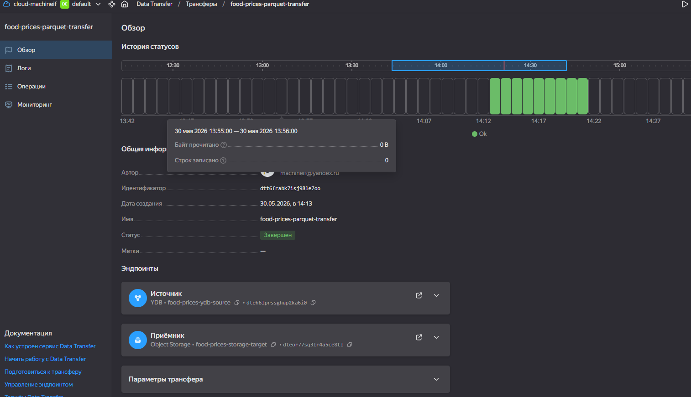

### 8. Проверка результата

После завершения трансфера был проверен результат в Object Storage.

В бакете появились parquet-файлы с результатом переноса данных из YDB.

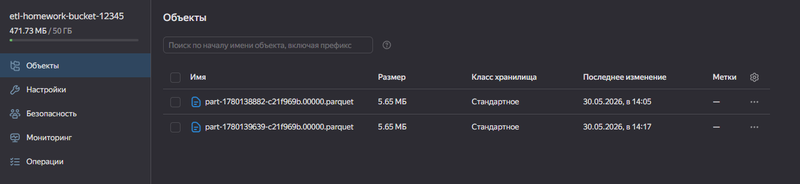

---

## Итог по заданию 1

В результате выполнения первого задания:

- был создан бакет Object Storage;
- создан сервисный аккаунт;
- создана база данных YDB;
- создана таблица food_prices;
- выполнен импорт CSV-файлов в YDB;
- настроен и запущен Data Transfer;
- данные были успешно перенесены в Object Storage.

В результате был реализован перенос данных из Managed Service for YDB в объектное хранилище Object Storage

---

# Задание 2.  Автоматизация работы с Yandex Data Processing при помощи Apache AirFlow

## Описание

Требуется обрабатывать файлы (parquet или CSV) из внешнего источника.
Размер входящих файлов меняется в различные дни месяца

### Используемый датасет

Age, Gender and Ethnicity Face Data CSV

Ссылка на датасет: https://www.kaggle.com/datasets/nipunarora8/age-gender-and-ethnicity-face-data-csv

Поля датасета: 
- age
- gender
- ethnicity
- img_name
- pixels

### Используемые сервисы

В задании использовались следующие сервисы Yandex Cloud:

- Managed Service for Apache Airflow
- Data Proc
- Object Storage
- Service Account

### Выполненные действия

- Создан кластер Data Proc
- Настроен Managed Airflow
- Создан DAG для автоматического запуска PySpark-задачи
- DAG:
  - создает кластер
  - запускает PySpark-скрипт
  - удаляет кластер после выполнения
- Результат обработки сохранен в Object Storage


### 1. Подготовка датасета

CSV-файл с датасетом был загружен в Object Storage

Далее этот файл использовался в PySpark-задаче для обработки данных

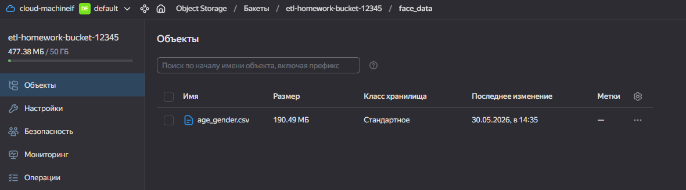


### 2. Создание кластера Data Proc

Для запуска PySpark-задачи был создан кластер Data Proc

Кластер использовался для выполнения распределённой обработки данных

### 3. Создание PySpark-скрипта

Был создан PySpark-скрипт process_face_data.py

Скрипт выполнял:

- чтение CSV-файла из Object Storage;
- обработку данных;
- сохранение результата обратно в бакет.

```python
from pyspark.sql import SparkSession

spark = SparkSession.builder.appName("FaceDataProcessing").getOrCreate()

df = spark.read.option("header", True).csv(
    "s3a://etl-homework-bucket-12345/age_gender.csv"
)

df.write.mode("overwrite").parquet(
    "s3a://etl-homework-bucket-12345/processed_face_data"
)

spark.stop()
```


### 4. Создание DAG Airflow

Для автоматизации запуска PySpark-задачи был создан DAG в Apache Airflow

Использовался уже существующий кластер Data Proc, поэтому DAG выполнял только запуск PySpark-job

Используемый оператор:

```python
DataprocCreatePysparkJobOperator
```


```python
from airflow import DAG
from airflow.utils.dates import days_ago
from airflow.providers.yandex.operators.yandexcloud_dataproc import (
    DataprocCreatePysparkJobOperator,
)

CLUSTER_ID = "c9qcvmpakqtlol00si1o"
YC_BUCKET = "etl-homework-bucket-12345"

with DAG(
    dag_id="final_etl_dataproc_dag",
    start_date=days_ago(1),
    schedule=None,
    catchup=False,
) as dag:

    run_pyspark_job = DataprocCreatePysparkJobOperator(
        task_id="run_pyspark_job",
        cluster_id=CLUSTER_ID,
        main_python_file_uri=f"s3a://{YC_BUCKET}/process_face_data.py",
    )
```

### 5. Загрузка DAG в Airflow

После создания DAG файл был загружен в Apache Airflow

В интерфейсе Airflow DAG успешно появился в списке задач


После загрузки DAG был вручную запущен через интерфейс Airflow

PySpark-задача успешно отправилась в Data Proc

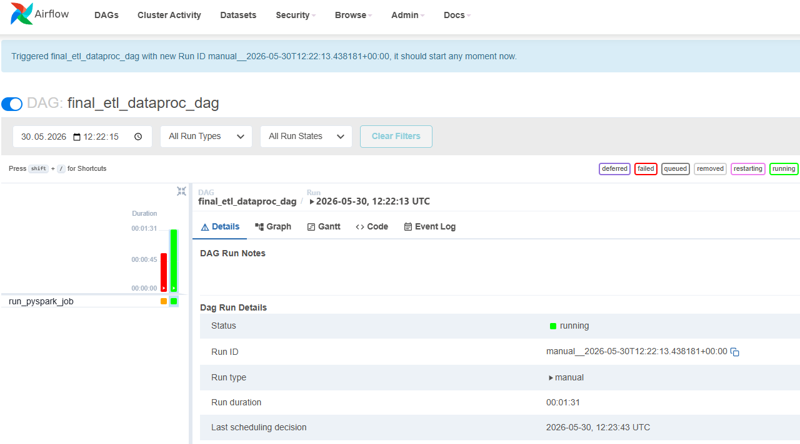

### 7. Успешное выполнение задачи

После завершения обработки задача успешно выполнилась


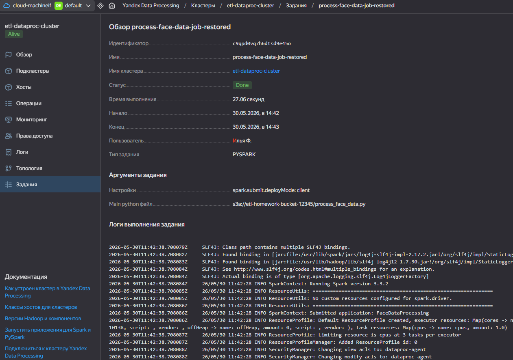


### 8. Проверка результата

После выполнения задания был проверен результат обработки данных в Object Storage

В бакете появились обработанные файлы

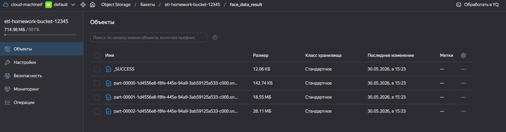

---

## Итог по заданию 2

 Обрабатывать файлы из внешнего источника

В результате выполнения второго задания:

- был подготовлен датасет;
- создан кластер Data Proc;
- написан PySpark-скрипт;
- создан DAG Apache Airflow;
- настроен запуск PySpark-задачи;
- задача успешно выполнилась;
- результат обработки был сохранён в Object Storage.
---

# Задание 3. Работа с топиками Apache Kafka® с помощью PySpark-заданий в Yandex Data Processing

### Описание

Необходимо было реализовать потоковую обработку данных с использованием:
- Managed Service for Apache Kafka;
- PySpark Structured Streaming;
- Object Storage.

### Используемый датасет

Indian Railways Dataset

Ссылка на датасет: https://www.kaggle.com/datasets/sripaadsrinivasan/indian-railways-dataset

Файл: schedules.json

### Выполненные действия

- Создан Kafka cluster
- Создан Kafka topic
- Создан Kafka user
- Реализован producer.py
- Реализован streaming_job.py
- Producer отправляет данные из JSON в Kafka
- Spark Streaming читает поток из Kafka
- Данные сохраняются в CSV
- CSV-файл загружен в Object Storage

### 1. Создание Kafka-кластера

В Yandex Cloud был создан Managed Service for Apache Kafka кластер

При создании были настроены:
- Kafka cluster;
- топик для сообщений;
- пользователи Kafka.

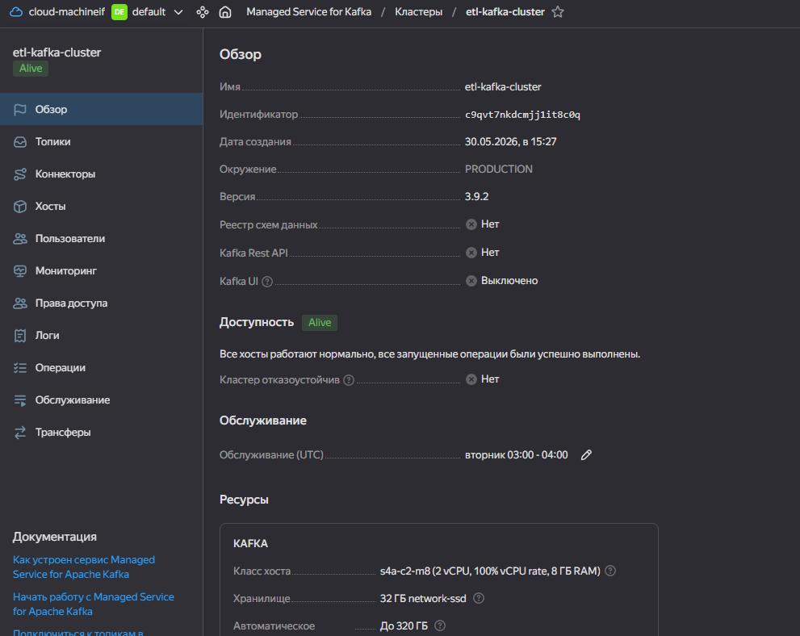


### 2. Создание Kafka topic

Для передачи сообщений был создан Kafka topic

В этот topic producer отправлял сообщения из JSON-файла


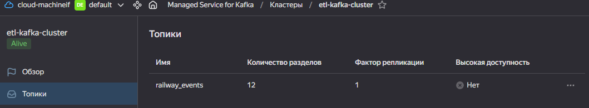


### 3. Создание пользователя Kafka

Для подключения producer и streaming job был создан пользователь Kafka


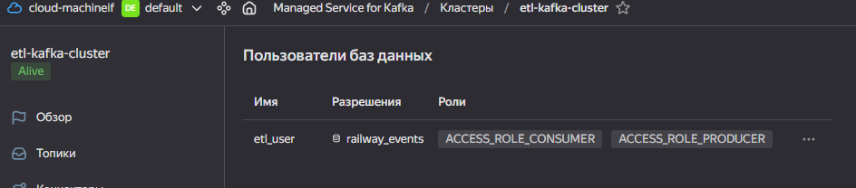


### 4. Подготовка producer-скрипта

Был реализован Python producer, который:
- считывал JSON-файл;
- подключался к Kafka;
- отправлял сообщения в topic.


```python
from pyspark.sql import SparkSession
from pyspark.sql.functions import to_json, struct, lit

spark = SparkSession.builder.appName("KafkaRailwayProducer").getOrCreate()

bootstrap_servers = "rc1e-rsk9162u1c95l9d7.mdb.yandexcloud.net:9091"
topic_name = "railway_events"

username = "etl_user"
password = "Etl123456!"

df = spark.read.option("multiline", True).json(
    "s3a://etl-homework-bucket-12345/schedules.json"
)

messages_df = df.select(
    lit("railway").alias("key"),
    to_json(struct("*")).alias("value")
)

messages_df.write \
    .format("kafka") \
    .option("kafka.bootstrap.servers", bootstrap_servers) \
    .option("topic", topic_name) \
    .option("kafka.security.protocol", "SASL_SSL") \
    .option("kafka.sasl.mechanism", "SCRAM-SHA-512") \
    .option(
        "kafka.sasl.jaas.config",
        f'org.apache.kafka.common.security.scram.ScramLoginModule required username="{username}" password="{password}";'
    ) \
    .save()

spark.stop()
```

### 5. Запуск задания

После запуска producer сообщения начали отправляться в Kafka


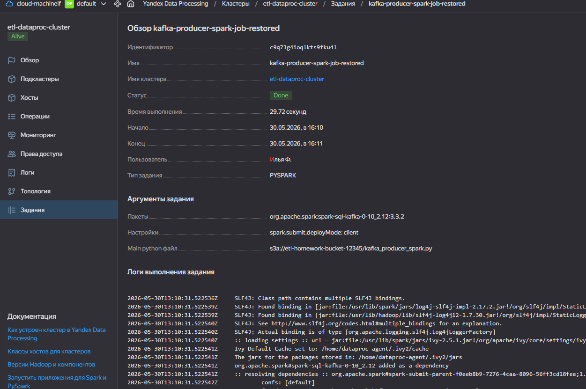


### 6. Реализация streaming job

Для потоковой обработки был реализован PySpark Structured Streaming job

Streaming job:
- подключался к Kafka;
- считывал сообщения из topic;
- преобразовывал JSON;
- выделял нужные поля;
- сохранял результат в CSV.

```python
from pyspark.sql import SparkSession
from pyspark.sql.functions import col, from_json
from pyspark.sql.types import StructType, StructField, StringType

spark = SparkSession.builder.appName("KafkaRailwayBatch").getOrCreate()

bootstrap_servers = "rc1e-rsk9162u1c95l9d7.mdb.yandexcloud.net:9091"
topic_name = "railway_events"
username = "etl_user"
password = "Etl123456!"

schema = StructType([
    StructField("train_number", StringType()),
    StructField("station_name", StringType()),
    StructField("arrival_time", StringType()),
    StructField("departure_time", StringType())
])

df = spark.read \
    .format("kafka") \
    .option("kafka.bootstrap.servers", bootstrap_servers) \
    .option("subscribe", topic_name) \
    .option("startingOffsets", "earliest") \
    .option("endingOffsets", "latest") \
    .option("kafka.security.protocol", "SASL_SSL") \
    .option("kafka.sasl.mechanism", "SCRAM-SHA-512") \
    .option(
        "kafka.sasl.jaas.config",
        f'org.apache.kafka.common.security.scram.ScramLoginModule required username="{username}" password="{password}";'
    ) \
    .load()

json_df = df.selectExpr("CAST(value AS STRING) as json_value")

parsed_df = json_df.select(
    from_json(col("json_value"), schema).alias("data")
)

result_df = parsed_df.select(
    col("data.train_number").alias("train_number"),
    col("data.station_name").alias("station_name"),
    col("data.arrival_time").alias("arrival_time"),
    col("data.departure_time").alias("departure_time")
)

result_df.coalesce(1).write \
    .mode("overwrite") \
    .option("header", True) \
    .csv("s3a://etl-homework-bucket-12345/kafka_result_csv/")

spark.stop()
```

## 7. Запуск streaming job

Streaming job был запущен в Data Proc

Во время выполнения происходило:
- чтение данных из Kafka;
- обработка сообщений;
- запись результата в Object Storage.


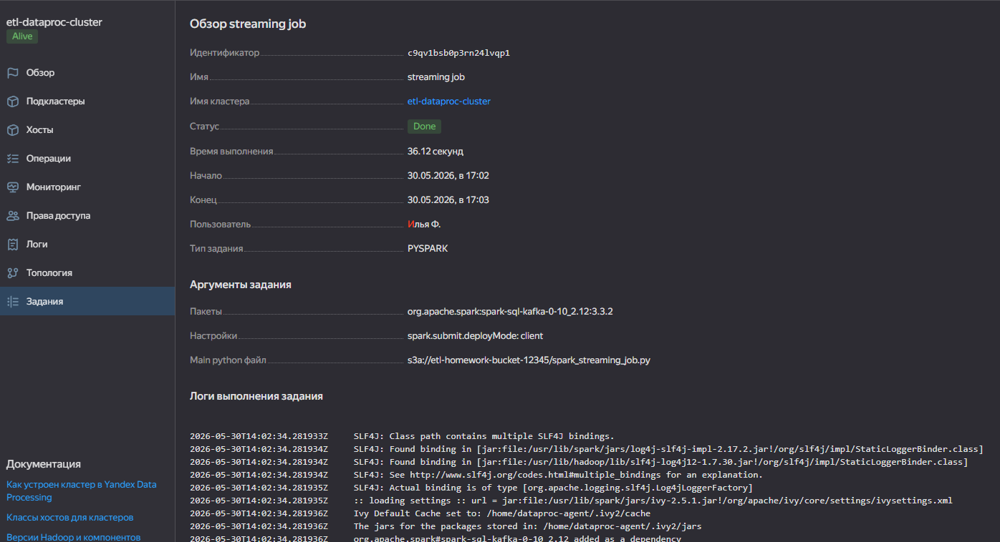

После завершения обработки результат был успешно сохранён в Object Storage

Spark автоматически создал:
- несколько part-файлов;
- файл _SUCCESS.

Несколько part-файлов появились потому, что Spark выполняет обработку параллельно и сохраняет результат по частям

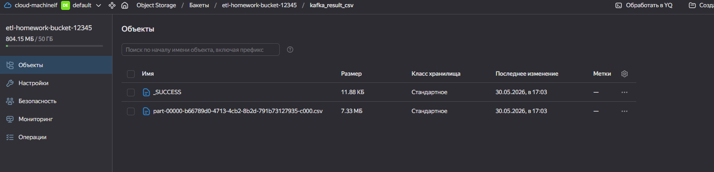

### 8. Kafka checkpoint

Во время работы PySpark Streaming автоматически создавались checkpoint-файлы для хранения состояния обработки

Checkpoint позволяет:
- отслеживать уже обработанные сообщения;
- восстанавливать обработку после сбоя;
- избегать повторной обработки данных.


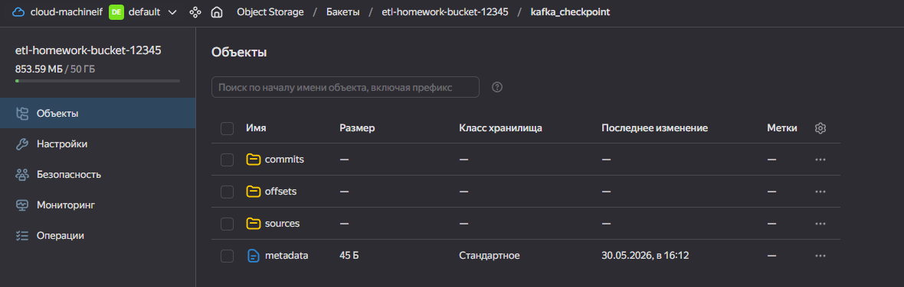

---
# Итог по заданию 3

Настроено чтение топиков kafka для реализации потоковой
аналитики

В результате выполнения третьего задания:

- был создан Kafka cluster в Yandex Cloud;
- был создан Kafka topic для передачи сообщений;
- был создан пользователь Kafka;
- был подготовлен JSON-файл schedules.json;
- был реализован producer для отправки сообщений в Kafka;
- был реализован PySpark Streaming job;
- данные из Kafka были обработаны и преобразованы в плоскую структуру;
- результат обработки был сохранён в Object Storage в формате CSV;
- Spark автоматически создал part-файлы и файл _SUCCESS.


# Задание 4. Визуализация в DataLens.


### Описание

В рамках задания была выполнена визуализация обработанных данных с помощью Yandex DataLens

В качестве источника данных использовались CSV-файлы, полученные после обработки потока данных в Kafka и PySpark Streaming


### Что было сделано

### 1. Подготовка данных

После выполнения третьего задания результат обработки данных был сохранён в Object Storage в формате CSV

Файлы содержали следующие поля:

- train_number
- station_name
- arrival_time
- departure_time


### 2. Загрузка CSV-файла в DataLens

В DataLens было создано новое подключение типа Файлы

В качестве источника был загружен CSV-файл с результатом обработки данных

После загрузки DataLens автоматически определил:
- названия колонок;
- типы данных;
- структуру таблицы.


### 3. Создание датасета

На основе загруженного CSV-файла был создан датасет

В датасете были доступны поля:
- номер поезда;
- название станции;
- время прибытия;
- время отправления.


### 4. Построение дашборда

На основе датасета была создана столбчатая диаграмма

Для визуализации использовались:
- station_name — по оси X;
- train_number — по оси Y.

В результате был построен дашборд с визуализацией данных по железнодорожным станциям и поездам


## Результат выполнения

В результате задания:
- был создан источник данных в DataLens;
- был создан датасет;
- была выполнена визуализация данных;
- был построен дашборд на основе обработанных данных из Kafka и PySpark Streaming.


# Итог

В ходе выполнения работы были изучены и использованы следующие сервисы Yandex Cloud:

- YDB
- Object Storage
- Data Transfer
- Managed Airflow
- Data Proc
- Managed Kafka
- Spark Streaming
- DataLens

Получены навыки:

- построения ETL-процессов
- автоматизации обработки данных
- потоковой обработки данных
- работы с Kafka
- работы со Spark Streaming
- визуализации данных