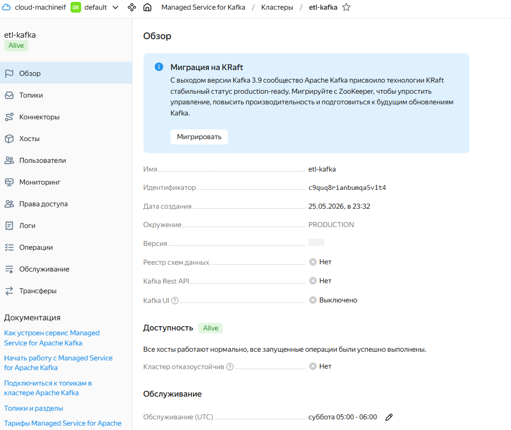
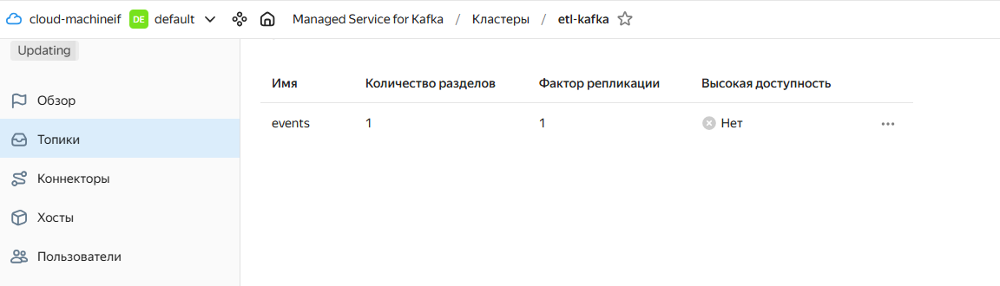

# Домашнее задание 15

# Ход выполнения

## 1. Создание Kafka кластера

В Yandex Cloud был создан кластер Managed Service for Apache Kafka.



---

## 2. Создание топика

Создан Kafka topic `events` для передачи сообщений.



---

# Producer

## 3. Реализация Kafka Producer

Для отправки сообщений в Kafka был написан PySpark producer.

Файл:

```text
kafka_producer.py
```

Код producer:

```python
from pyspark.sql import SparkSession

spark = SparkSession.builder.appName("kafka-producer").getOrCreate()

data = [
    (1, "click"),
    (2, "purchase"),
    (3, "login")
]

df = spark.createDataFrame(data, ["id", "event"])

kafka_df = df.selectExpr(
    "CAST(id AS STRING) AS key",
    "CAST(event AS STRING) AS value"
)

kafka_df.write \
    .format("kafka") \
    .option(
        "kafka.bootstrap.servers",
        "rc1e-i2k1lc5cfnp64b58.mdb.yandexcloud.net:9091"
    ) \
    .option("topic", "events") \
    .option("kafka.security.protocol", "SASL_SSL") \
    .option("kafka.sasl.mechanism", "SCRAM-SHA-512") \
    .option(
        "kafka.sasl.jaas.config",
        'org.apache.kafka.common.security.scram.ScramLoginModule required username="etl_user" password="Etl123456";'
    ) \
    .save()

spark.stop()
```

---

## 4. Успешный запуск Producer

Producer успешно отправил сообщения в Kafka topic.


---

# Consumer

## 5. Реализация Kafka Consumer

Для чтения сообщений из Kafka был написан PySpark consumer.

Файл:

```text
kafka_consumer.py
```

Код consumer:

```python
from pyspark.sql import SparkSession

spark = SparkSession.builder.appName("kafka-consumer").getOrCreate()

df = spark.read \
    .format("kafka") \
    .option(
        "kafka.bootstrap.servers",
        "rc1e-i2k1lc5cfnp64b58.mdb.yandexcloud.net:9091"
    ) \
    .option("subscribe", "events") \
    .option("startingOffsets", "earliest") \
    .option("kafka.security.protocol", "SASL_SSL") \
    .option("kafka.sasl.mechanism", "SCRAM-SHA-512") \
    .option(
        "kafka.sasl.jaas.config",
        'org.apache.kafka.common.security.scram.ScramLoginModule required username="etl_user" password="Etl123456";'
    ) \
    .load()

result = df.selectExpr(
    "CAST(key AS STRING)",
    "CAST(value AS STRING)"
)

result.show(truncate=False)

spark.stop()
```

---

## 6. Успешный запуск Consumer

Consumer успешно прочитал сообщения из Kafka topic.


---